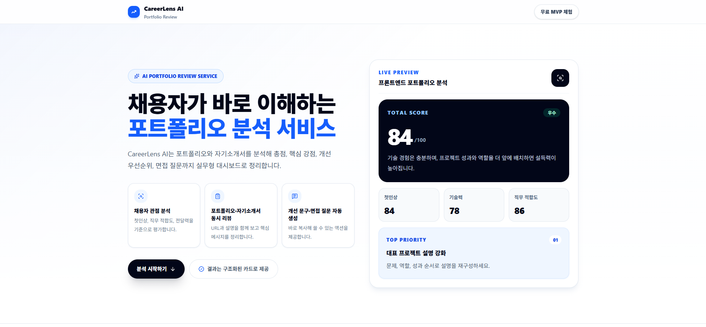

# CareerLens AI



CareerLens AI는 포트폴리오와 자기소개서 내용을 입력하면 지원 직무 기준으로 점수와 개선 방향을 정리해주는 리뷰 도구입니다. 총점, 세부 점수, 강점, 보완점, 개선 문구, 예상 면접 질문과 답변을 한 화면에서 확인할 수 있습니다.

## 주요 기능

- 지원 직무별 포트폴리오 분석
- OpenAI Structured Outputs 기반 JSON 결과 생성
- 종합 점수와 5개 세부 점수 카드
- 핵심 강점 3개, 보완점 3개, 개선 우선순위 TOP 5
- 프로젝트 설명 개선 문구 생성 및 복사
- 예상 면접 질문 5개와 답변 예시
- 입력 품질 점검 카드
- 개선 우선순위 체크리스트
- 분석 결과 복사 및 PDF 저장
- Supabase 기반 결과 저장, 공유 리포트, 히스토리, 삭제
- Supabase 미설정 시 저장 기능 fallback
- Mock Demo Mode로 API 비용 없이 화면 확인
- 데스크톱/모바일 반응형 UI

## 기술 스택

- Next.js App Router
- React
- TypeScript
- Tailwind CSS
- OpenAI Responses API
- Supabase
- Vercel

## 프로젝트 구조

```txt
app/
  api/
    analyze/     # OpenAI 분석 API route
    save/        # 분석 결과 저장
    history/     # 저장 결과 조회/삭제
  report/[id]/   # 공유 리포트 페이지
components/      # UI 컴포넌트
lib/
  openai.ts      # OpenAI structured output schema
  supabase.ts    # Supabase server client
  mock-analysis.ts
supabase/
  schema.sql     # analyses 테이블 생성 SQL
types/
  index.ts       # 입력/결과 타입
```

## 환경변수

루트에 `.env.local` 파일을 만들고 필요한 값을 넣습니다.

```env
OPENAI_API_KEY=your_openai_api_key
OPENAI_MODEL=gpt-5-mini

SUPABASE_URL=https://your-project.supabase.co
SUPABASE_SERVICE_ROLE_KEY=your_service_role_key
```

Mock Demo Mode를 사용할 때만 아래 값을 추가합니다.

```env
MOCK_ANALYSIS=true
NEXT_PUBLIC_MOCK_ANALYSIS=true
```

주의:

- `.env.local`은 Git에 올리지 않습니다.
- `OPENAI_API_KEY`와 `SUPABASE_SERVICE_ROLE_KEY`에는 `NEXT_PUBLIC_`을 붙이지 않습니다.
- `SUPABASE_URL`은 `https://xxxxx.supabase.co`까지만 입력하고 `/rest/v1`은 붙이지 않습니다.

## Supabase 설정

1. Supabase 프로젝트를 생성합니다.
2. SQL Editor에서 `supabase/schema.sql` 내용을 실행합니다.
3. Project Settings의 Data API/API 화면에서 Project URL을 복사합니다.
4. API Keys 화면에서 Secret key 또는 legacy service role key를 복사합니다.
5. `.env.local`에 `SUPABASE_URL`, `SUPABASE_SERVICE_ROLE_KEY`를 입력합니다.

## 실행 방법

```bash
npm install
npm run dev
```

브라우저에서 `http://localhost:3000`으로 접속합니다.

## 검증

```bash
npm run lint
npm run build
```

## 배포

Vercel 배포 기준:

1. GitHub 저장소에 프로젝트를 업로드합니다.
2. Vercel에서 저장소를 Import합니다.
3. Project Settings > Environment Variables에 `.env.local`과 동일한 값을 등록합니다.
4. 실제 분석 기능을 사용할 경우 `MOCK_ANALYSIS` 값은 등록하지 않거나 `false`로 설정합니다.
5. 비용 없이 화면만 확인할 경우 `MOCK_ANALYSIS=true`, `NEXT_PUBLIC_MOCK_ANALYSIS=true`를 설정합니다.

## 포트폴리오 설명 문구

CareerLens AI는 포트폴리오와 자기소개서를 입력받아 지원 직무 기준으로 점수와 피드백을 정리하는 리뷰 도구입니다. Next.js App Router와 TypeScript로 화면과 서버 API를 구성했고, OpenAI Structured Outputs로 분석 결과를 JSON 형태로 받도록 구현했습니다. Supabase로 결과 저장, 히스토리, 공유 리포트, 삭제 기능을 연결했으며, Mock Demo Mode를 통해 API 호출 없이도 결과 화면을 확인할 수 있습니다.
